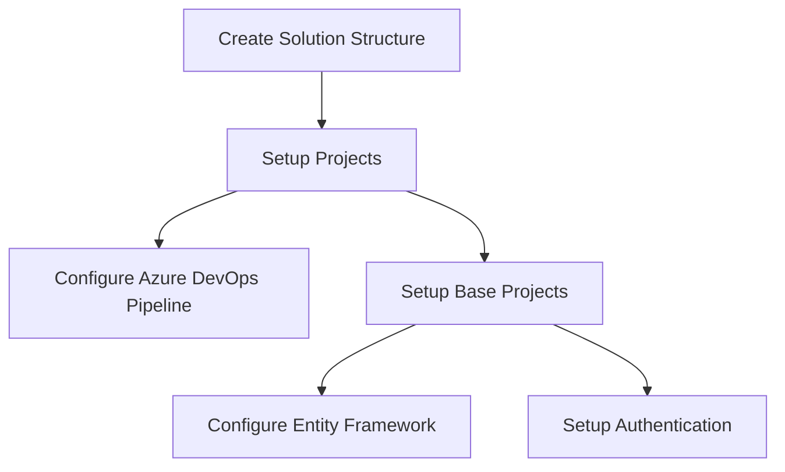

# Studio Scheduler

## Project Overview
Studio Scheduler is a cloud-hosted web application for managing dance/fitness studio classes, with both desktop (admin/operator) and mobile (student) interfaces.

## Technical Stack

### Frontend
- Blazor WebAssembly (.NET 9, upgrade to .NET 10 LTS planned)
- MudBlazor for UI components
- Fluxor for state management
- PWA capabilities for mobile

### Backend
- ASP.NET Core 9 API
- Entity Framework Core 9
- SignalR for real-time features
- JWT-based authentication (simple, role-based)

### Infrastructure
- Azure hosting (App Service)
- PostgreSQL on Azure
- Azure Application Insights
- Azure Blob Storage

## Solution Structure
```
StudioScheduler/
├── src/
│   ├── StudioScheduler.Client/           # Blazor WASM
│   ├── StudioScheduler.Server/           # ASP.NET Core API
│   ├── StudioScheduler.Core/             # Domain Models & Interfaces
│   ├── StudioScheduler.Infrastructure/    # Data Access & External Services
│   └── StudioScheduler.Shared/           # DTOs & Shared Models
├── tests/
│   ├── StudioScheduler.UnitTests/
│   └── StudioScheduler.IntegrationTests/
└── tools/                                # DB migrations, scripts
```

## Implementation Plan

Based on the requirements and technical specifications, here's a structured plan for implementing the Studio Scheduler project:

### Phase 1: Project Setup and Core Infrastructure (First Steps)


1. Create the solution structure following the specified pattern:
   - StudioScheduler.Client (Blazor WASM)
   - StudioScheduler.Server (ASP.NET Core API)
   - StudioScheduler.Core (Domain Models)
   - StudioScheduler.Infrastructure (Data Access)
   - StudioScheduler.Shared (DTOs)

2. Initial project setup:
   - Create GitFlow structure (main/develop branches)
   - Setup .gitignore and solution files
   - Configure NuGet packages
   - Setup development environment

3. Setup Core Data Models:
   - User entity
   - Class entity
   - Schedule entity
   - Pass entity
   - Reservation entity

4. Configure Entity Framework:
   - PostgreSQL connection
   - Initial migrations
   - Repository patterns

5. Authentication Infrastructure:
   - JWT configuration
   - Basic user service
   - Role-based authorization

### Phase 2: Basic Backend Implementation
- API endpoints for CRUD operations
- Business logic implementation
- Service layer setup
- Basic error handling
- Logging setup

### Phase 3: Frontend Foundation
- Blazor project setup with MudBlazor
- Authentication UI
- Basic layouts and navigation
- Core components structure

### Phase 4: Feature Implementation
- Class management module
- User management module
- Pass system
- Reservation system
- Real-time updates with SignalR

### Phase 5: Azure Infrastructure
- App Service setup
- Database deployment
- Application Insights integration
- CI/CD pipeline completion
