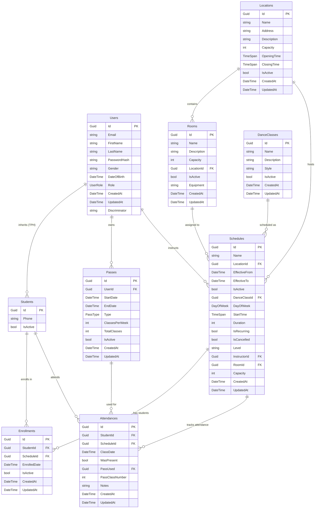
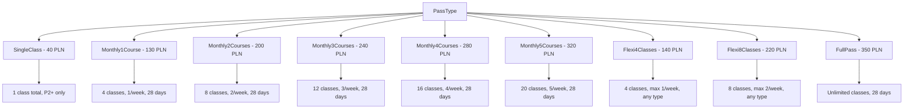

# Database Model - Studio Scheduler - 2025-06-20_23-44

## Entity Relationship Diagram

## Business Rules and Constraints

### Entity Constraints

1. **User/Student Inheritance**
   - Uses Table-Per-Hierarchy (TPH) with Discriminator column
   - All Students are Users but not all Users are Students

2. **Location/Room Hierarchy**
   - Rooms belong to exactly one Location
   - Locations can have multiple Rooms
   - Schedules can specify both Location and specific Room

3. **Schedule Configuration**
   - Must have a Location and DanceClass
   - Instructor is optional (can be TBD)
   - Room is optional (can use general Location)
   - EffectiveTo is optional (ongoing schedules)

4. **Pass Business Logic**
   - 10 different PassTypes with unique rules
   - Complex weekly limits and validity periods
   - Rich domain methods for calculations

5. **Enrollment vs Attendance**
   - Enrollment: Student signs up for a recurring schedule
   - Attendance: Individual class participation records
   - Student can be enrolled but miss classes

### Delete Behavior

- **Cascade**: Student deletion removes all Passes, Enrollments, Attendances
- **Restrict**: Cannot delete Location/Room/Schedule with dependent records
- **Set Null**: Pass deletion nullifies Attendance.PassUsed references

### Key Features

1. **Audit Trail**: All entities have CreatedAt/UpdatedAt timestamps
2. **Soft Delete**: IsActive flags for logical deletion
3. **Guid Keys**: Distributed system ready with Guid primary keys
4. **Rich Domain**: Pass entity contains complex business logic
5. **Flexible Scheduling**: Support for recurring and one-time classes

## PassType Enumeration

## UserRole Enumeration

- **Admin**: Full system access
- **DeskPerson**: Front desk staff with limited admin access
- **Student**: Can book and attend classes

## Database Implementation Notes

- **Development**: SQLite database at `src/StudioScheduler.Server/studioscheduler.db`
- **Production**: PostgreSQL with Azure hosting
- **Migrations**: Entity Framework Core 9 with migration history
- **Performance**: Indexed foreign keys and common query patterns
- **Security**: Password hashing, role-based access control
