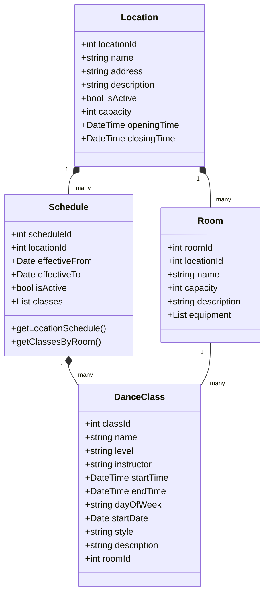

# Schedule Implementation Plan

## Project Overview
The schedule system is designed to manage dance classes across multiple locations, supporting the current single-location setup while being scalable for future expansion.

## Data Model

### Location Management

### Key Features
1. **Location Management**
   - Multiple location support
   - Location-specific schedules
   - Room management within locations

2. **Schedule Management**
   - Dance class CRUD operations
   - Schedule effective dates
   - Room assignment and availability

3. **Query Capabilities**
   - Location-specific schedules
   - Room availability
   - Class filtering (by style, level, instructor)

## Implementation Phases

### Phase 1: Basic Schedule Display and Management
- Core data models implementation
- Basic CRUD operations for schedules
- Single location support
- Simple schedule display

### Phase 2: Student Registration System
- Student registration functionality
- Class capacity management
- Email notifications - skip for now
- Payment integration - skip for now

### Phase 3: Attendance Tracking
- Check-in system
- Attendance reports
- Instructor dashboard
- Student attendance history

### Phase 4: Advanced Features
- Waitlist management
- Level progression tracking
- Multi-location support
- Cross-location reporting
- Advanced analytics

## Future Considerations

### Scalability
- Design supports multiple locations
- Easy to add new rooms and locations
- Flexible schedule management

### Integration Points
- Payment systems
- Email service
- SMS notifications
- Mobile app support

### Performance
- Caching strategies for schedule data
- Optimized queries for large datasets
- Real-time updates consideration
