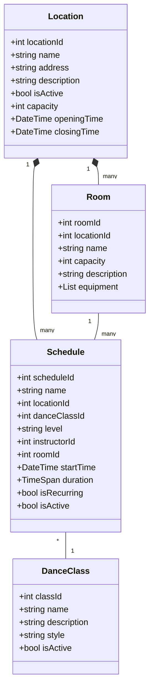

# Schedule Implementation Plan

## Project Overview
The schedule system is designed to manage dance classes across multiple locations, supporting the current single-location setup while being scalable for future expansion.

## Data Model

### Location Management

### Architecture Overview
The system follows real-world dance studio business operations:

#### DanceClass (Dance Style Definition)
- **Purpose**: Defines dance styles/types (e.g., "Bachata", "Salsa Cubana", "Salsa on1")
- **Properties**: Name, Description, Style (BACHATA, SALSA, ZOUK, KIZOMBA, etc.)
- **Static**: These represent dance genres, not specific classes
- **Reusable**: Multiple class groups can use the same dance style

#### Schedule (Class Group)
- **Purpose**: Represents actual class groups with specific characteristics
- **Properties**: Level (P1, P2, P3, S1, S2, S3), Instructor, Room, StartTime, Duration
- **Dynamic**: Groups evolve over time - levels change, instructors change, groups merge/split
- **Business Logic**: Handles real-world scenarios like group progression and reorganization

### Key Features
1. **Location Management**
   - Multiple location support
   - Location-specific schedules
   - Room management within locations

2. **Class Group Management**
   - Dynamic class group creation and modification
   - Level progression tracking
   - Instructor assignment and changes
   - Group merging and splitting capabilities

3. **Query Capabilities**
   - Location-specific schedules
   - Room availability
   - Class filtering (by style, level, instructor)
   - Group evolution history

## Implementation Phases

### Phase 1: Basic Schedule Display and Management
- Core data models implementation (DanceClass as styles, Schedule as groups)
- Basic CRUD operations for dance styles and class groups
- Single location support
- Simple schedule display with proper level and instructor information

### Phase 2: Student Registration System
- Student registration functionality for specific class groups
- Class group capacity management
- Email notifications - skip for now
- Payment integration - skip for now

### Phase 3: Attendance Tracking
- Check-in system for class groups
- Attendance reports per group
- Instructor dashboard for their assigned groups
- Student attendance history across different groups

### Phase 4: Advanced Features
- Waitlist management for popular class groups
- Level progression tracking within groups
- Group merging and splitting capabilities
- Multi-location support
- Cross-location reporting
- Advanced analytics for group performance

### Phase 5: Business Intelligence
- Group evolution history tracking
- Student progression analytics
- Instructor performance metrics
- Capacity optimization recommendations
- Semester planning tools

## Future Considerations

### Scalability
- Design supports multiple locations
- Easy to add new rooms and locations
- Flexible class group management
- Support for multiple instructors per dance style

### Business Operations
- Semester planning and group reorganization
- Instructor substitution and availability management
- Group progression and level advancement tracking
- Student retention and progression analytics

### Integration Points
- Payment systems
- Email service for group notifications
- SMS notifications for schedule changes
- Mobile app support for students and instructors

### Performance
- Caching strategies for schedule data
- Optimized queries for large datasets
- Real-time updates for group changes
- Efficient group merging and splitting operations
